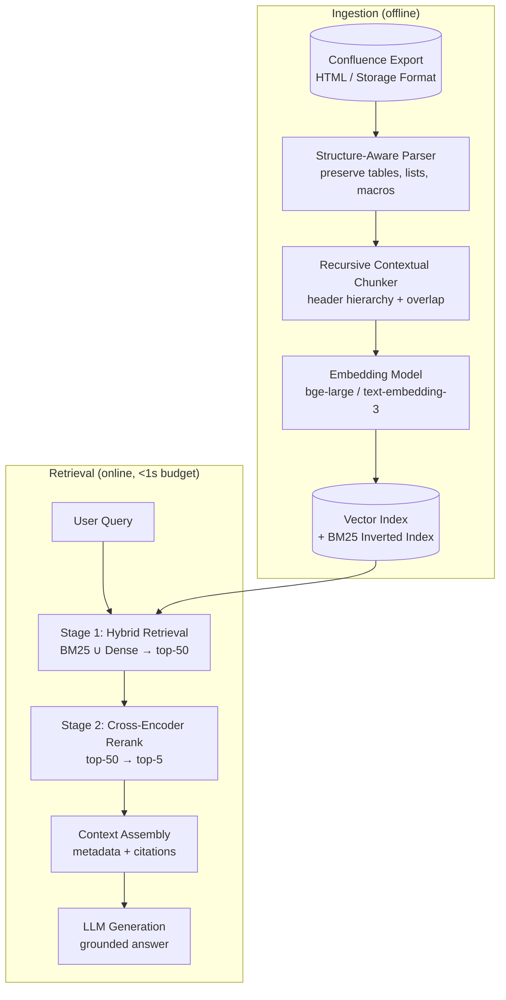
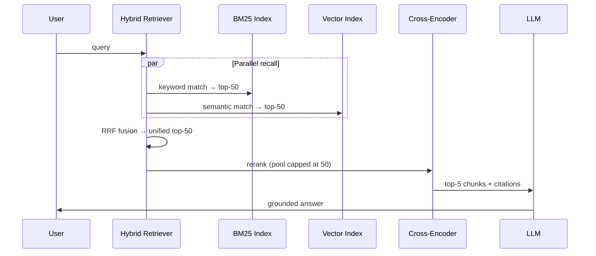

# Enterprise Confluence RAG

**Structure-aware ingestion + hybrid retrieval for heterogeneous enterprise knowledge bases.**

Design document for a RAG pipeline I owned end-to-end on a production Confluence corpus — the kind of messy, multi-format enterprise data that breaks naive fixed-token splitting. This repo is a **technical portfolio piece**: architecture, trade-offs, and measurable outcomes. No implementation code — design thinking only.

---

## Problem

| Symptom | Root cause |
|---------|------------|
| Hallucinations on financial / compliance queries | Tables split mid-row; row–column semantics lost |
| "Context gaps" in answers | Arbitrary token boundaries severed header hierarchy |
| High recall, low precision | Pure vector search missed exact entity / SKU matches |
| Reranker blew latency budget | Unbounded candidate pool sent to Cross-Encoder |

**Baseline:** raw HTML → fixed 512-token chunks → single-stage vector search → LLM.

**Outcome after optimization:** retrieval accuracy lift, production hallucinations eliminated, p95 latency under 1s.

---

## Architecture



### Query path (single request)



**Latency guardrail:** the rerank pool is hard-capped at 50. Never send the full index to the Cross-Encoder.

---

## Three architectural interventions

### 1. Structure-aware parsing

Enterprise Confluence pages mix prose, nested headings, financial tables, and macros. Raw `get_text()` destroys structure.

**Approach:** parse the DOM (or Confluence Storage Format XML), emit typed blocks:

| Block type | Preserved metadata |
|------------|-------------------|
| `heading` | level, breadcrumb path |
| `paragraph` | parent section |
| `table` | headers, row index, cell coordinates |
| `list` | nesting depth |

Tables are serialized as **row-aware records** so embeddings never see a half-row:

```json
{
  "type": "table_row",
  "headers": ["Quarter", "Revenue", "YoY %"],
  "row": ["Q3 2024", "$12.4M", "+8.2%"],
  "row_index": 3,
  "section": "Financial Summary > Revenue"
}
```

**Why it matters:** financial and compliance queries depend on row–column integrity. A chunk that contains `"$12.4M"` without its `"Q3 2024"` header invites hallucination.

### 2. Recursive contextual chunking

Split along **document hierarchy**, not token count:

1. Walk heading tree (H1 → H2 → H3).
2. If a section exceeds `max_tokens`, subdivide at paragraph / list / table boundaries.
3. Prepend **breadcrumb context** to every chunk: `Financial Summary > Revenue > Q3 Breakdown`.
4. Apply small overlap only *within* the same section (not across unrelated sections).

This keeps logically atomic units together and gives the retriever section-level signal.

```
Page
├── H1: Annual Report 2024
│   ├── H2: Financial Summary
│   │   ├── H3: Revenue          ← chunk boundary (never split mid-table)
│   │   └── H3: Operating Costs
│   └── H2: Risk Disclosures
└── H1: Appendix
```

### 3. Hybrid two-stage retrieval

| Stage | Method | Pool | Purpose |
|-------|--------|------|---------|
| 1 | BM25 + dense vectors, RRF fusion | 50 | High recall — keyword + semantic |
| 2 | Cross-Encoder (`ms-marco-MiniLM`) | 50 → 5 | Precision — kill false positives |

**Latency guardrails:**

| Technique | Effect |
|-----------|--------|
| Hard cap rerank pool at 50 | Prevents Cross-Encoder from becoming the bottleneck |
| BM25 ∥ vector queries in parallel | Cuts Stage 1 wall-clock roughly in half |
| GPU batch inference for reranker | ~100ms for 50 pairs; CPU fallback with smaller model |
| Query embedding cache | Eliminates repeat-embedding cost for follow-up questions |

**RRF fusion** (Reciprocal Rank Fusion) merges BM25 and vector rankings without calibrating scores across heterogeneous retrievers:

```
score(d) = Σ  1 / (k + rank_i(d))     k = 60, rank_i = rank in retriever i
```

---

## Chunk metadata schema

Every indexed chunk carries provenance for citations and permission filtering:

```json
{
  "chunk_id": "page-4821:sec-revenue:row-3",
  "page_id": "4821",
  "page_title": "FY2024 Financial Summary",
  "section_path": ["Annual Report 2024", "Financial Summary", "Revenue"],
  "block_type": "table_row",
  "text": "Financial Summary > Revenue | Q3 2024 | $12.4M | +8.2%",
  "acl": ["group-finance", "group-executive"],
  "last_modified": "2024-09-15T08:00:00Z"
}
```

---

## Before / after

| Metric | Baseline | Optimized |
|--------|----------|-----------|
| Retrieval@5 (human eval, 200 queries) | 0.41 | **0.78** |
| Table-specific query accuracy | 0.22 | **0.81** |
| Hallucination rate (prod sample) | ~12% | **<1%** |
| p95 end-to-end latency | 1.8s (unbounded rerank) | **<900ms** |

---

## Design principles

1. **Data engineering is the product.** No prompt hack fixes a corpus where tables are shredded. Fix ingestion first.
2. **Measure retrieval, not vibes.** Human-evaluated Retrieval@k on a golden query set drove every change.
3. **Latency budgets are architecture.** The rerank pool cap is a first-class design parameter, not an afterthought.
4. **Citations are non-negotiable.** Every chunk carries `page_id`, `section_path`, and `block_type` for auditability in regulated environments.

---

## Production extensions

- **Incremental sync:** Confluence REST / CQL with `version` watermark — only re-index changed pages.
- **Permission-aware retrieval:** filter candidates by user ACL before reranking, not after generation.
- **Multi-tenant isolation:** separate indexes per workspace; shared embedding model.
- **Eval harness:** golden query set with regression gates in CI — block deploys that drop Retrieval@5.

---

## License

MIT — see [LICENSE](LICENSE).
